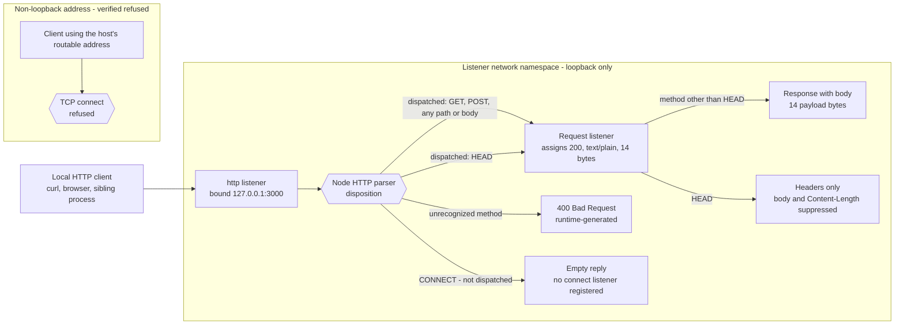
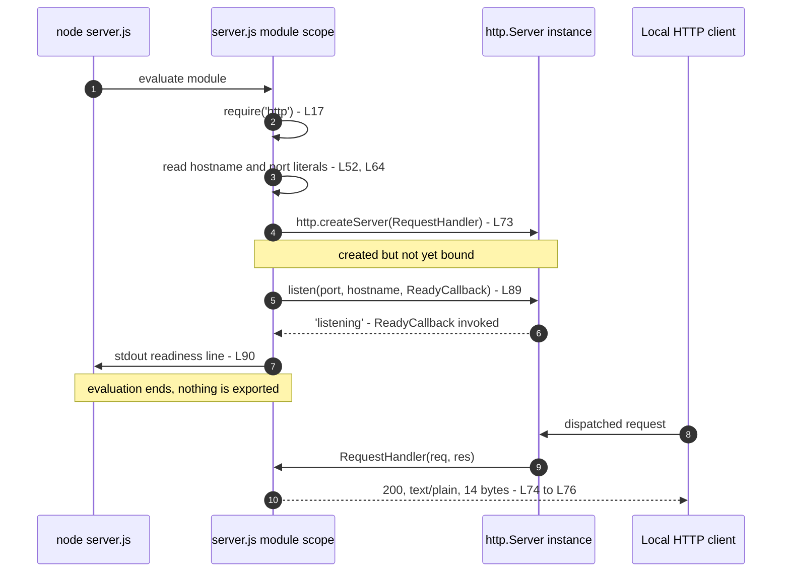

# ARUI_4488_Check_Onboarding

A minimal HTTP service. One Node.js `http` listener, bound to the IPv4 loopback
interface, answers every request the runtime dispatches to it with the same
plain-text greeting. Fourteen lines of executable and structural source carry
the whole program; the file holding them is annotated, so it reads longer than
it acts.

This document is the project's complete documentation: what the service does,
how to run it, the contract it answers with, how it is deployed and operated,
and a walkthrough of every line of its source. It is self-contained. Every fact
below is either stated here or reproducible by a command given here.

## Overview

**What it is.** A single `http.Server`, constructed and bound while `server.js`
is being evaluated (`server.js:L73` and `server.js:L89`). Its one `'request'`
listener assigns status `200`, sets `Content-Type: text/plain` and writes
fourteen bytes — `Hello, World!` followed by a newline (`server.js:L74` to
`server.js:L76`). Its readiness callback writes one line to stdout
(`server.js:L90`), which is the service's only readiness signal.

**What it is not.** It is not a web framework, an API gateway or a routed
application. There is no route table, no status code other than the one it
assigns, no request parsing, no authentication, no TLS and no persistence. The
full inventory is in [Limitations and Non-Goals](#limitations-and-non-goals).

**Terminology.** One term per concept throughout this document, matching the
contract names recorded in the source:

- **Request listener** — the arrow function passed to `http.createServer`
  (`server.js:L73`), documented in the source as `RequestHandler`.
- **Readiness callback** — the arrow function passed to `server.listen`
  (`server.js:L89`), documented in the source as `ReadyCallback`.
- **Loopback bind** — the consequence of the `hostname` literal
  (`server.js:L52`): the listener accepts connections only from within its own
  network namespace.

The request and network path below shows the four dispositions the Node.js HTTP
parser applies to an inbound request. Two of them reach the request listener,
and only one of those two puts a body on the wire.



Dispatch is the runtime's decision rather than the application's, so the three
non-baseline paths are described where they belong, in
[API Documentation](#api-documentation).

## Table of Contents

- [Prerequisites](#prerequisites)
- [Setup and Quick Start](#setup-and-quick-start)
- [API Documentation](#api-documentation)
- [Configuration](#configuration)
- [Code Walkthrough](#code-walkthrough)
- [Deployment Guide](#deployment-guide)
- [Troubleshooting](#troubleshooting)
- [Limitations and Non-Goals](#limitations-and-non-goals)
- [Project Information](#project-information)

## Prerequisites

### Platform scope

Every command in this document is POSIX shell, verified on GNU/Linux with bash
5.2. The service itself is platform-neutral: the source uses nothing
platform-specific, only the Node.js runtime and its core `http` module. Nothing
is claimed about platforms that were not tested.

Two places a Windows or non-bash reader must adapt:

- Stopping the process uses `Ctrl+C` in the foreground, or `taskkill` rather
  than a POSIX signal.
- The byte-count and process-lookup one-liners (`wc -c` and
  `ps -eo pid,cmd`) have no direct `cmd` or PowerShell equivalent.

### Node.js runtime

Check what is installed:

```bash
node --version
```

It prints the version installed on the machine. No particular value is
required, because the project declares none — which is why the following two
facts are deliberately kept separate:

- **The support floor** is what the source needs: ES2015 syntax (arrow
  functions and template literals), CommonJS `require`, and the core `http`
  module. That is everything the fourteen lines use.
- **The verification baseline** is Node.js v22.23.2. Every observed output
  reproduced in this document was captured on it.

The project declares no supported range. There is no `package.json` and
therefore no `engines` field, and no `.nvmrc`, `.node-version` or
`.tool-versions`. This document consequently states no minimum, no maximum and
no range, because the project has never declared one. Install the runtime from
[nodejs.org](https://nodejs.org/).

### A free TCP port 3000

The listener binds `127.0.0.1:3000`, and both halves of that address are fixed
in the source (`server.js:L52` and `server.js:L64`). Port 3000 must be free on
the loopback interface of the network namespace you start the service in, or
the process exits; see
[A port collision ends the process](#a-port-collision-ends-the-process).

Port 3000 is unprivileged, so no elevated identity is required to bind it.

### No dependency install step

There is no `npm install` step. That is a property of the project, not an
omission from this document. Two things a reader may conflate:

- **Installing Node.js** is a machine prerequisite, satisfied once per machine.
- **Installing project dependencies** is a step that does not exist here at
  all. The only `require` in the source targets Node's built-in `http` module
  (`server.js:L17`), which ships with the runtime. The repository contains no
  `package.json`, no lockfile, no `node_modules` and no third-party package.

## Setup and Quick Start

### Obtain the source

Two paths are supported, both credential-free because the repository is public.
Note which one you used: the procedures in
[Rollback and recovery](#rollback-and-recovery) differ between them.

Clone the repository:

```bash
git clone https://github.com/lakshya-blitzy/ARUI_4488_Check_Onboarding.git
cd ARUI_4488_Check_Onboarding
```

Expect a new `ARUI_4488_Check_Onboarding` directory holding exactly two tracked
files, `server.js` and this document. There is nothing further to fetch.

Or copy `server.js` alone into any directory. That is legitimate here: the file
has no manifest, no sibling files and no relative imports, so it is
self-sufficient.

### Run the service

`node server.js` resolves the path relative to the current directory, so it
works only from the directory that contains the file:

```bash
node server.js
```

Observed output — exactly one line, on stdout:

```text
Server running at http://127.0.0.1:3000/
```

To start it from any other directory, give an absolute path instead:

```bash
node /absolute/path/to/server.js
```

Expect the same single readiness line: the bind address and port come from the
source, not from the working directory, so the output does not change.

The process runs in the foreground and does not detach; it stays attached to
the terminal until stopped. See
[Start, stop and restart](#start-stop-and-restart).

### Verify the service

From a second terminal, with the service running:

```bash
curl -i http://127.0.0.1:3000/
```

Observed response — curl writes its transfer-progress meter to stderr, and
only the response itself is reproduced here:

```text
HTTP/1.1 200 OK
Content-Type: text/plain
Date: Tue, 08 Sep 2026 13:31:16 GMT
Connection: keep-alive
Keep-Alive: timeout=5
Content-Length: 14

Hello, World!
```

Two of those fields are set by the application: the `200` status line
(`server.js:L74`) and `Content-Type` (`server.js:L75`). The rest are generated
by the runtime, and `Date` in particular is a timestamp that varies between
calls. [Status and header attribution](#status-and-header-attribution)
separates them field by field.

Count the payload:

```bash
curl -s http://127.0.0.1:3000/ | wc -c
```

Observed output:

```text
14
```

## API Documentation

### One contract, not a set of endpoints

There is no route table. A single request listener answers every request the
runtime dispatches to it, so what follows is one contract rather than a
collection of endpoints. Method, path, query string, headers and request body
are never inspected (`server.js:L73` to `server.js:L77`).

### What the handler does, and what appears on the wire

These are two different things, and the contract separates them.

**Handler actions, invariant for every dispatched request.** The request
listener assigns status `200` (`server.js:L74`), sets the header
`Content-Type: text/plain` (`server.js:L75`), then calls `res.end` with a
14-byte string (`server.js:L76`). None of the three varies with method, path,
query string, headers or request body.

**Wire observables.** Status and media type are invariant for dispatched
requests. The 14-byte body is observable only where the runtime does not
suppress it: it appears for `GET`, `POST` and other dispatched methods, and it
does not appear for `HEAD`, which Node answers with headers alone and no
`Content-Length`. The handler behaves identically in both cases.

**Whole responses.** The invariants are the application-controlled status,
media type and fourteen payload bytes. The remaining fields are
runtime-generated, and `Date` is cached at one-second granularity, so two
replies captured in quick succession may carry the same timestamp while two
captured further apart will not. This document therefore asserts the
application-controlled fields and describes the rest as runtime-generated.

The five measured cases:

| Request                    | Class       | Result summary       |
| -------------------------- | ----------- | -------------------- |
| `GET /`                    | Baseline    | `200`, 14-byte body  |
| `POST /api/does-not-exist` | Baseline    | `200`, 14-byte body  |
| `HEAD /`                   | Exception 1 | `200`, no body       |
| `FOO / HTTP/1.1`           | Exception 2 | `400`, listener idle |
| `CONNECT example.com:443`  | Exception 3 | Empty reply          |

### Status and header attribution

The source sets exactly one status code and exactly one response header.
`res.statusCode` (`server.js:L74`) writes the status line, which is not a
header. Everything else on the wire is added by the runtime.

| Response field   | Set by      | Value or origin                    |
| ---------------- | ----------- | ---------------------------------- |
| Status line      | Application | `200` (`server.js:L74`)            |
| `Content-Type`   | Application | `text/plain` (`server.js:L75`)     |
| Body             | Application | 14 bytes (`server.js:L76`)         |
| `Content-Length` | Runtime     | Derived; absent on a `HEAD` reply  |
| `Date`           | Runtime     | Timestamp, varies between calls    |
| `Connection`     | Runtime     | Keep-alive negotiation             |
| `Keep-Alive`     | Runtime     | Keep-alive negotiation             |

### Baseline requests

A `GET`, reduced to the two application-controlled fields:

```bash
curl -s -o /dev/null -w '%{http_code} %{content_type}\n' \
  http://127.0.0.1:3000/
```

Observed output:

```text
200 text/plain
```

The full response, including the runtime-generated fields, is in
[Verify the service](#verify-the-service), and the 14-byte payload count is
there too.

A non-`GET` method, on a path the service knows nothing about, carrying a
request body:

```bash
curl -s -i -X POST --data 'ignored=payload' \
  http://127.0.0.1:3000/api/does-not-exist
```

Observed response — method, path and body are all ignored, and the reply is
the same as for `GET /`:

```text
HTTP/1.1 200 OK
Content-Type: text/plain
Date: Tue, 08 Sep 2026 13:36:16 GMT
Connection: keep-alive
Keep-Alive: timeout=5
Content-Length: 14

Hello, World!
```

### Selected exceptional cases

Three cases where the observable result differs from a baseline `GET`. They are
selected notes on runtime behaviour rather than a complete account of the
Node.js HTTP parser: everything further down the protocol stack — an
unsupported `Expect` value, `Expect: 100-continue`, malformed headers, socket
timeouts and `Date` header caching among them — is runtime-defined and outside
the contract this project owns.

All three are driven from a raw socket, because `curl` cannot send an
unrecognized method or an unhandled `CONNECT` usefully, and `curl -I` cannot
prove that a `HEAD` reply carried zero body bytes. Define the probe once:

```bash
wire() {
  python3 -c '
import socket, sys
tail = b"\r\nHost: 127.0.0.1:3000\r\nConnection: close\r\n\r\n"
s = socket.create_connection(("127.0.0.1", 3000), timeout=3)
s.sendall(sys.argv[1].encode() + tail)
raw = b""
while True:
    chunk = s.recv(4096)
    if not chunk:
        break
    raw += chunk
s.close()
head, _, body = raw.partition(b"\r\n\r\n")
print("received bytes:", len(raw))
print(head.decode("latin-1"))
print("body bytes:", len(body))
' "$1"
}
```

Defining it produces no output. Each invocation below prints the byte count it
received, the header block, and the number of body bytes that followed.

**Exception 1 — `HEAD` is dispatched, and the runtime suppresses the body.**
The request listener runs unchanged; the reply carries the status and the
media type but no `Content-Length` and no body bytes.

```bash
wire 'HEAD / HTTP/1.1'
```

Observed output:

```text
received bytes: 101
HTTP/1.1 200 OK
Content-Type: text/plain
Date: Tue, 08 Sep 2026 13:36:16 GMT
Connection: close
body bytes: 0
```

**Exception 2 — an unrecognized method never reaches the application.** The
parser rejects it and generates the reply itself, so the request listener does
not run and no application code executes.

```bash
wire 'FOO / HTTP/1.1'
```

Observed output:

```text
received bytes: 47
HTTP/1.1 400 Bad Request
Connection: close
body bytes: 0
```

**Exception 3 — `CONNECT` bypasses the request listener.** `CONNECT` raises the
`'connect'` event rather than `'request'`, and the source registers no
`'connect'` listener, so the socket closes with nothing sent.

```bash
wire 'CONNECT example.com:443 HTTP/1.1'
```

Observed output — the empty line is the probe printing an empty header block:

```text
received bytes: 0

body bytes: 0
```

### Not implemented

None of the following exists in this service. The list matters because a single
unconditional contract otherwise invites being read as a general-purpose API.

- No routing and no route table; the path is never examined.
- No `404` and no `405`; the only status the application assigns is `200`.
- No error responses and no error handling in the request path.
- No request-body handling and no query-string handling; `req` is accepted but
  never inspected.
- No authentication and no authorization.
- No TLS; the listener speaks cleartext HTTP only.
- No CORS headers.
- No compression and no content negotiation.

[Limitations and Non-Goals](#limitations-and-non-goals) carries the wider
inventory, including the operational absences.

## Configuration

### The configuration surface

Two literals in the source are the entire configuration surface. `process.env`
is never read anywhere in the file.

| Constant   | Literal       | Location        |
| ---------- | ------------- | --------------- |
| `hostname` | `'127.0.0.1'` | `server.js:L52` |
| `port`     | `3000`        | `server.js:L64` |

`hostname` is the IPv4 loopback literal, and binding it confines the service to
its own network namespace: a client on the same host reaches it, while a
request to that host's routable address is refused. `port` is unprivileged, so
no elevated identity is needed to bind it, and no fallback port exists — a
collision ends the process. Both are passed to `server.listen`
(`server.js:L89`) and interpolated into the readiness line
(`server.js:L90`).

### Environment variables have no effect

Neither `PORT` nor `HOST` is read, so neither can override the literals.
Attempting to override them is the most likely operator error, so it is worth
demonstrating. With the address and port already bound by a running instance,
starting a second process with both variables set still fails on
`127.0.0.1:3000` rather than on the values supplied:

```bash
PORT=8080 HOST=0.0.0.0 node server.js
```

Observed output (first lines; the process exits with status 1):

```text
node:events:497
      throw er; // Unhandled 'error' event
      ^

Error: listen EADDRINUSE: address already in use 127.0.0.1:3000
```

The address named in the failure is the source literal, not `0.0.0.0:8080`,
which is what proves both variables were ignored.

### Change a configuration value

There is no configuration file and no runtime override, so the two literals are
fixed at commit time. Changing either is a source edit:

1. Edit the literal in `server.js` — `hostname` at `server.js:L52` or `port` at
   `server.js:L64`.
2. Restart the process; see
   [Start, stop and restart](#start-stop-and-restart). Nothing is re-read while
   the process runs, because there is no configuration to re-read.
3. Commit the edit, since the value is only durable once committed.
4. Update this document, because the addresses and ports quoted throughout it
   are the literals from the source.

## Code Walkthrough

### Startup sequence

The module's most surprising property is that it does its work while it is
being evaluated: `http.createServer` and `server.listen` both run at module
scope, and nothing is exported. Requiring this file therefore starts a
listener, which is why it is meant to be run with `node server.js` and not
imported. The ordered interaction:



Startup is immediate in practice: readiness was observed at roughly 30 ms and a
first `200` completed within roughly 65 ms of a cold start. Those figures are
indicative measurements on the verification baseline, not a guarantee.

### The source, line by line

Fourteen lines of executable and structural source carry the whole program.
They are unchanged from the project's pre-annotation state; the JSDoc comment
blocks around them are documentation and are not walked through here, since
they are themselves the annotation. Locators below resolve against the
annotated file as delivered.

- **`server.js:L17` — `const http = require('http');`** The sole `require` in
  the project. It targets Node's built-in `http` module, which ships with the
  runtime, so there is nothing to install.
- **`server.js:L52` — `const hostname = '127.0.0.1';`** The bind address, and
  the reason the service is reachable only from within its own network
  namespace.
- **`server.js:L64` — `const port = 3000;`** The bind port. Unprivileged and
  fixed, with no fallback.
- **`server.js:L73` — `const server = http.createServer((req, res) => {`**
  Constructs the `http.Server` and registers the inline arrow function as its
  sole `'request'` listener. Construction happens here, at module evaluation;
  binding happens later, at `server.js:L89`.
- **`server.js:L74` — `res.statusCode = 200;`** Assigns the status
  unconditionally. This writes the status line, not a header.
- **`server.js:L75` — `res.setHeader('Content-Type', 'text/plain');`** Sets the
  one response header the application controls.
- **`server.js:L76` — `res.end('Hello, World!\n');`** Writes the fourteen-byte
  payload and ends the response. Thirteen characters of greeting plus the
  newline is where the count of fourteen comes from.
- **`server.js:L77` — `});`** Closes the request listener and the
  `http.createServer` call.
- **`server.js:L89` — `server.listen(port, hostname, () => {`** Binds the
  listener to the two configuration literals and registers the inline arrow
  function as the readiness callback. This is the line that makes the process
  start serving.
- **`server.js:L90` — the `console.log` template literal.** Writes the single
  readiness line, interpolating `hostname` and `port` so the logged URL always
  matches the address actually bound. This is the service's only stdout output.
- **`server.js:L91` — `});`** Closes the readiness callback and the
  `server.listen` call.

The remaining three of the fourteen are blank separators between the four
groups — the import, the configuration literals, the server construction and
the bind. In the annotated file they survive as the blank lines at
`server.js:L18`, `server.js:L65` and `server.js:L78`.

Two properties follow from the whole and are easy to miss line by line. The
request listener never reads `req`, so the reply cannot depend on the request.
And because there are no exports and both `createServer` and `listen` run at
module scope, there is no way to import this module without starting a
listener.

## Deployment Guide

This section documents deployment; it adds no deployment artifact. The
repository contains no Dockerfile, no continuous-integration workflow, no
process-manager unit and no reverse-proxy configuration, and none is required
to run the service.

### Placement and execution identity

The program reads and writes no files, opens no database and holds no state, so
where it sits on disk is unconstrained beyond the working-directory rule in
[Run the service](#run-the-service). Port 3000 is unprivileged, so no elevated
identity is needed to bind it — and none should be used. Run it as an ordinary
unprivileged account.

### Execution mode and supervision

`node server.js` runs in the foreground and does not detach, which suits local
and development use. A durable deployment needs an external supervisor, because
the program itself provides no daemonization, no restart behaviour and no
process management.

What a supervisor must supply:

- **Restart on exit.** The process exits on a fatal bind failure and has no
  internal recovery, so restarting it is the supervisor's job.
- **Capture of both output streams.** stdout carries readiness, stderr carries
  the runtime's failure traces. See [Logging: two streams](#logging-two-streams).
- **Start on boot.** Nothing in the project arranges for the service to run
  after a reboot.

This document names those requirements. It does not configure a supervisor, and
no supervisor configuration is part of this repository.

### Start, stop and restart

Start it as described in [Run the service](#run-the-service). Readiness is the
single startup line and nothing else: there is no health endpoint to poll, so
the log line is the only readiness signal available.

Stop it with `Ctrl+C` while it holds the foreground. Otherwise find the process
and signal it by PID:

```bash
ps -eo pid,cmd | grep "[s]erver.js"
```

Observed output:

```text
   6151 node server.js
```

Then terminate it by that numeric PID, using the default `SIGTERM`:

```bash
kill 6151
```

Observed result — the process is gone, and the lookup above now matches
nothing:

```text
(no matching process)
```

`lsof`, `ss` and `fuser` are not reliably present on every host, which is why
the lookup uses `ps`. The bracket in `"[s]erver.js"` stops `grep` from matching
its own command line.

Restart is stop and then start. There is no reload signal, and no configuration
is re-read on restart, because there is no configuration file to re-read.

### Logging: two streams

Which stream carries what matters, because a supervisor that captures only one
of them will hide the failures worth seeing.

- **stdout** carries exactly one line, at startup (`server.js:L90`), and
  nothing thereafter. There is no request log and no application error log.
- **stderr** carries nothing from the application, but the runtime may write an
  unhandled-exception trace to it — which is precisely what a port collision
  produces.

"The application logs one line" is true. "The process outputs nothing else" is
not. A supervisor must capture both streams to diagnose a failed start.

### Exposure topology

The listener binds `127.0.0.1:3000` (`server.js:L52`, `server.js:L64` and
`server.js:L89`) and accepts only from within its own network namespace. A
request to the host's own routable address is refused, which is verified:

```bash
curl -sS --noproxy '*' -m 3 "http://$(hostname -I | awk '{print $1}'):3000/"
```

Observed output — in the verification environment `hostname -I` returned
`10.99.0.1`, and curl's single output line is wrapped here to fit this
document's width:

```text
curl: (7) Failed to connect to 10.99.0.1 port 3000 after 0 ms:
Could not connect to server
```

`--noproxy '*'` is required. Without it an ambient `http_proxy` setting makes
curl test the proxy rather than a direct connection.

Three consequences follow from how loopback binding and network namespaces
work. They are stated as platform behaviour, not as results measured here: the
probe above stays inside one namespace and deliberately does not cross a
namespace boundary.

- A **reverse proxy can** serve this application if it runs in the same network
  namespace. It connects to `127.0.0.1:3000` and listens itself on a routable
  address. The proxy provides the remote exposure; the application never does.
- A **container cannot** be reached by publishing a port, because a published
  port does not reach a container-local loopback listener. Host networking
  places the process in the host's namespace, which makes it reachable through
  the host's own loopback — it does not make `127.0.0.1:3000` remotely
  routable, and it does not substitute for publication. Remote access still
  requires a separate listener on a routable address, from a proxy or sidecar
  sharing the namespace.
- Reaching the service **directly from another host** requires changing the
  bind address in the source, which is a code change and outside the scope of
  this document.

The exclusive resource is the `127.0.0.1:3000` tuple within one network
namespace. A second instance in the same namespace fails to bind, while
separate namespaces on the same host can each run one instance.

### Indicative sizing

An allowance of roughly 128 MB of memory and one core is sufficient, and the
process is single-threaded with no clustering. That is a measured
idle-and-burst envelope rather than a capacity recommendation: the repository
declares no deployment target, and this document sets no performance objective.

### Post-deployment verification

A short probe against an already-running instance. It neither starts nor stops
anything. It is the only procedure in this document that takes parameters —
substitute the host and port your instance is reachable on:

```bash
curl -i http://<host>:<port>/
curl -s http://<host>:<port>/ | wc -c
```

Expect the status line `HTTP/1.1 200 OK` with `Content-Type: text/plain` from
the first command, and `14` from the second.

This is deliberately not the project's acceptance procedure. That procedure
owns its own process on port 3000 and starts a second instance on purpose to
reproduce a port collision; run against a live deployment it would collide with
the incumbent and misreport.

### Rollback and recovery

Recovery from a crash is a restart. The process holds no state, writes no files
and has no database or cache, so there is nothing to repair first.

A restart is state-safe but not connection-safe. Nothing can be corrupted, but
the source registers no `SIGTERM` or `SIGINT` handler and never calls
`server.close()`, so termination drops in-flight keep-alive connections without
draining them, and a restart under load is visible to clients. That consequence
follows from what the source does not contain rather than from a measurement.

Rolling the deployed files back depends on how they were obtained. In both
cases restore `server.js` and `README.md` together: this document's line
locators resolve against the annotated source, so reverting one without the
other leaves citations pointing at lines that no longer hold what they claim.

**Cloned repository.** List the revisions, then restore the pair from the one
you want:

```bash
git log --oneline
git checkout HEAD~1 -- server.js README.md
```

`HEAD~1` restores the pair as of the previous commit; substitute any revision
identifier from the `git log --oneline` output to go further back. Expect
`git status` to show both files staged for restoration afterwards.

**Copied file.** Restore the copy of both files you kept before the change.
That requires having kept one, which is the reason to prefer the clone path for
anything beyond a throwaway run.

Both procedures finish with the probe in
[Post-deployment verification](#post-deployment-verification) rather than with
the restore command: a restored file is not yet a running service.

There is no migration, no schema and no persisted artifact to reverse, so an
operator should not look for one.

## Troubleshooting

Two failure modes have been reproduced against this service. Each has a single
cause and a single diagnostic, so they are listed here rather than drawn as a
decision tree.

### A port collision ends the process

Starting an instance while `127.0.0.1:3000` is already bound in the same
network namespace terminates the new process. The bind failure arrives as an
`'error'` event, and because the source registers no `'error'` listener the
event goes unhandled: the runtime writes a stack trace to stderr and the
process exits non-zero.

Diagnostic — start it and read stderr:

```bash
node server.js
```

Observed output, with the process exiting with status 1. Two stack-frame lines
are wrapped onto continuation lines to fit this document's width; nothing else
is altered:

```text
node:events:497
      throw er; // Unhandled 'error' event
      ^

Error: listen EADDRINUSE: address already in use 127.0.0.1:3000
    at Server.setupListenHandle [as _listen2] (node:net:1941:16)
    at listenInCluster (node:net:1998:12)
    at node:net:2207:7
    at process.processTicksAndRejections
      (node:internal/process/task_queues:89:21)
Emitted 'error' event on Server instance at:
    at emitErrorNT (node:net:1977:8)
    at process.processTicksAndRejections
      (node:internal/process/task_queues:89:21) {
  code: 'EADDRINUSE',
  errno: -98,
  syscall: 'listen',
  address: '127.0.0.1',
  port: 3000
}

Node.js v22.23.2
```

`EADDRINUSE` and the address in the message are the whole diagnosis. Find the
incumbent process and decide which instance you want:

```bash
ps -eo pid,cmd | grep "[s]erver.js"
```

Expect one line per running instance, in the same `PID` and command form shown
in [Start, stop and restart](#start-stop-and-restart).

Resolution: stop the incumbent as described in
[Start, stop and restart](#start-stop-and-restart) and start again, or run the
second instance in a separate network namespace, where `127.0.0.1:3000` is a
different socket. Setting `PORT` does not help; see
[Environment variables have no effect](#environment-variables-have-no-effect).

### A request from another host is refused

Any request to a non-loopback address is refused. The listener does not accept
on a non-loopback address, not even one belonging to its own host. There is no
partial state to inspect: the TCP connection never completes, so nothing
reaches the application and nothing is logged.

Diagnostic — probe both addresses and compare:

```bash
curl -s --noproxy '*' -m 3 -o /dev/null -w '%{http_code}\n' \
  http://127.0.0.1:3000/
curl -s --noproxy '*' -m 3 -o /dev/null -w '%{http_code}\n' \
  "http://$(hostname -I | awk '{print $1}'):3000/"
```

Observed output — `200` from the loopback address and `000` from the routable
one, `000` being curl's code for a connection that never produced an HTTP
response:

```text
200
000
```

If both probes return `000` the service is not running at all: start it and
check for the readiness line. If the loopback probe returns `200`, the service
is working as written and the refusal is the loopback bind doing its job.
Reaching the service from elsewhere is a question of exposure rather than a
fault; see [Exposure topology](#exposure-topology).

## Limitations and Non-Goals

Everything below is absent by construction. Each is recorded as a fact about
this service rather than left to be discovered.

**Request handling.**

- No routing and no route table; the request path is never examined.
- No `404` and no `405`; the only status the application assigns is `200`.
- No error responses and no error handling in the request path.
- No request-body handling and no query-string handling.
- No authentication and no authorization.
- No TLS; the listener speaks cleartext HTTP only.
- No CORS headers.
- No compression and no content negotiation.

**Process lifecycle.**

- No graceful shutdown: no `SIGTERM` handler, no `SIGINT` handler and no
  `server.close()` call, so termination drops keep-alive connections without
  draining them.
- No `'error'` listener on the server, so a bind failure is fatal.
- No clustering and no worker processes; the process is single-threaded.
- No daemonization, no restart behaviour and no process management.

**Observability.**

- No health endpoint and no readiness endpoint; the startup line is the only
  readiness signal.
- No request logging and no application error logging.
- No metrics and no tracing.

**Configuration and packaging.**

- No environment-variable configuration; `process.env` is never read.
- No configuration file and no command-line arguments.
- No `package.json`, no lockfile and no dependency beyond the runtime.
- No exports, so the module cannot be imported without starting a listener.

**Project infrastructure.**

- No tests and no test framework.
- No continuous integration.
- No linter and no formatter.
- No license file; see [License status](#license-status).
- No contribution guide; see [Contribution status](#contribution-status).

## Project Information

### Runtime basis

Two facts, kept separate exactly as in [Node.js runtime](#nodejs-runtime):

- **Support floor** — ES2015 syntax, CommonJS `require`, and the core `http`
  module. That is everything the source uses.
- **Verification baseline** — Node.js v22.23.2, on which every observed output
  in this document was captured.

The project declares no supported version range, and this document invents
none.

### License status

The repository contains no license file, so the terms under which this software
may be used, copied, modified or redistributed are undefined. This document
states no terms: selecting them is a decision for the project owner rather than
something documentation can supply.

### Contribution status

The repository contains no contribution guide, so there is no documented
process for proposing a change — no branch convention, no review requirement
and no checklist.

### Documentation ownership

Documentation ownership is not assigned. There is no `CODEOWNERS` file, no
contribution guide and no maintainer field anywhere in the repository. Git
records a single author across the project's commits, which establishes past
authorship rather than ongoing ownership, so no owner is named here. Assigning
ownership is a decision for the project owner.

**Proposed practice, not policy in force.** The following needs the project
owner's adoption before it can be treated as a rule: a change to `server.js`
should carry the obligation to re-verify the observed outputs in this document
and update it in the same change. The repository has no automated gate — no
continuous integration and no documentation check — so review is the only
mechanism available to apply it.

### Freshness

Last verified: 2026-09-08 · Node.js v22.23.2 · baseline source revision 7daf3c8

The date and the runtime are the load-bearing fields: they record when the
checks behind this document last passed, and on what. `7daf3c8` is the baseline
source revision — the pre-annotation state of `server.js` that the behaviour
described here was measured against. It is not the revision of the delivered
file.

Refresh rule: any change to `server.js` obliges re-running the checks and
updating the date and the runtime above. Update the baseline revision only once
a new baseline is committed.

This marker is metadata about the document rather than a description of the
service, which is why it is the only place a date appears outside captured
protocol output.
