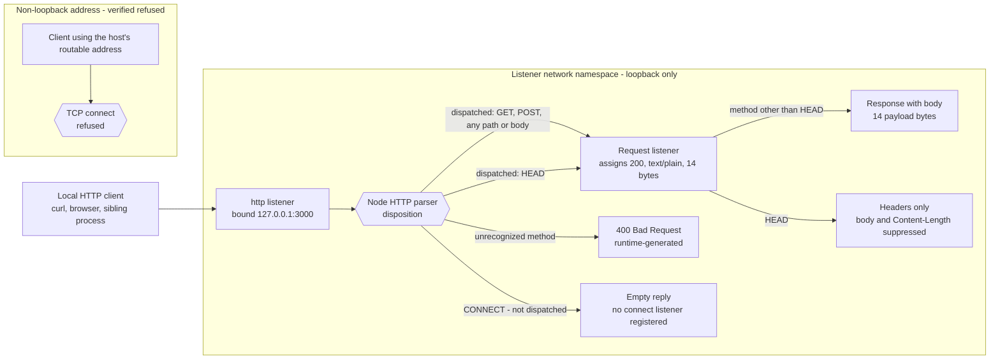
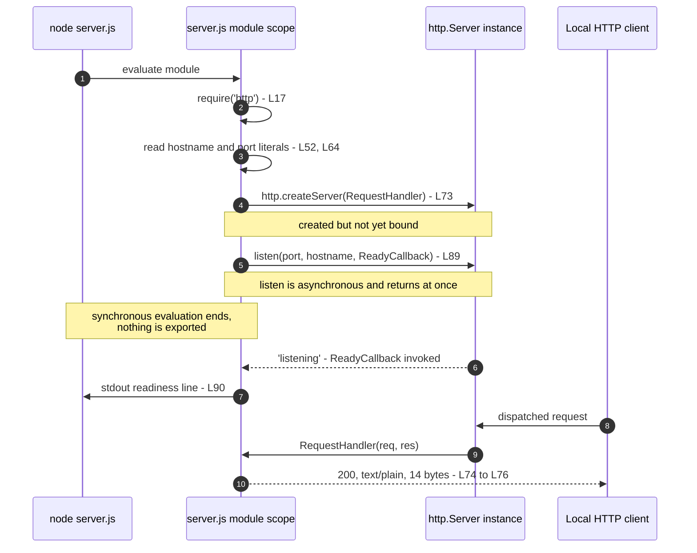

# ARUI_4488_Check_Onboarding

A minimal HTTP service. One Node.js `http` listener, bound to the IPv4 loopback
interface, answers every request the runtime dispatches to it with the same
status, media type and greeting bytes — a body the runtime suppresses for
`HEAD`. Fourteen lines of executable and structural source carry the whole
program; the file holding them is annotated, so it reads longer than it acts.

This document is the project's complete documentation: what the service does,
how to run it, the contract it answers with, how it is deployed and operated,
and a walkthrough of every line of its source. It is self-contained. Every fact
below is either stated here or reproducible by a command given here.

## Overview

**What it is.** A single `http.Server`, constructed and bound while `server.js`
is being evaluated (`server.js:L73` and `server.js:L89`). Its one `'request'`
listener assigns status `200`, sets `Content-Type: text/plain` and writes
fourteen bytes — `Hello, World!` followed by a newline (`server.js:L74` to
`server.js:L76`). Its readiness callback writes one line to stdout
(`server.js:L90`), which is the service's only readiness signal.

**What it is not.** It is not a web framework, an API gateway or a routed
application. There is no route table, no status code the application assigns
other than `200`, no application-level inspection of the request — method,
path, query, headers and body are never read — no authentication, no TLS and
no persistence. The runtime is a separate matter: it parses every inbound
request and can answer one itself without the application taking part, which
is what an unrecognized method drawing a parser-generated `400` demonstrates
under [Selected exceptional cases](#selected-exceptional-cases). The full
inventory is in [Limitations and Non-Goals](#limitations-and-non-goals).

**Terminology.** One term per concept throughout this document, matching the
contract names recorded in the source:

- **Request listener** — the arrow function passed to `http.createServer`
  (`server.js:L73`), documented in the source as `RequestHandler`.
- **Readiness callback** — the arrow function passed to `server.listen`
  (`server.js:L89`), documented in the source as `ReadyCallback`.
- **Loopback bind** — the consequence of the `hostname` literal
  (`server.js:L52`): the listener accepts connections only from within its own
  network namespace.

The request and network path below shows four measured dispositions of an
inbound request, selected because each one is observable to a caller of this
service. They are not a complete account of the Node.js HTTP parser, which
follows further paths of its own that lie outside the contract this project
owns. Two of the four reach the request listener, and only one of those two
puts a body on the wire.



Dispatch is the runtime's decision rather than the application's, so the three
non-baseline paths are described where they belong, in
[API Documentation](#api-documentation).

## Table of Contents

- [Prerequisites](#prerequisites)
- [Setup and Quick Start](#setup-and-quick-start)
- [API Documentation](#api-documentation)
- [Configuration](#configuration)
- [Code Walkthrough](#code-walkthrough)
- [Deployment Guide](#deployment-guide)
- [Troubleshooting](#troubleshooting)
- [Limitations and Non-Goals](#limitations-and-non-goals)
  - [Security and data handling](#security-and-data-handling)
- [Project Information](#project-information)

## Prerequisites

### Platform scope

Every command in this document is POSIX shell, verified on GNU/Linux with bash
5.2. The service itself is platform-neutral: the source uses nothing
platform-specific, only the Node.js runtime and its core `http` module. Nothing
is claimed about platforms that were not tested.

Two places a Windows or non-bash reader must adapt. Each substitution has to
reach the same result as the POSIX form it replaces, and that result is what to
check it against:

- Stopping the process uses `Ctrl+C` in the foreground, or `taskkill` rather
  than a POSIX signal. Expected result: the process exits, and a process lookup
  afterwards finds no matching service process — the same end state the `kill`
  step in [Start, stop and restart](#start-stop-and-restart) reaches.
- The byte-count one-liner (`wc -c`) and the process identity check in
  [Start, stop and restart](#start-stop-and-restart), which reads `ps` and
  Linux `/proc`, have no direct `cmd` or PowerShell equivalent. Expected
  results: the byte-count substitute reports `14` for the response payload, as
  in [Verify the service](#verify-the-service), and the identity substitute
  confirms exactly one process running this `server.js` while the service runs
  and none once it has stopped.

Those results are the requirement each substitute has to meet. No output is
quoted for the substitutes themselves, because they were not run here.

### Node.js runtime

Check what is installed:

```bash
node --version
```

It prints the version installed on the machine. The project declares no numeric
Node.js version requirement, which is not the same as every version working:
the source does need particular language and library features, and a runtime
that can run them is not automatically one you should install. That is why the
following three facts are deliberately kept separate:

- **The support floor** is what the source needs: ES2015 syntax (the arrow
  functions at `server.js:L73` and `server.js:L89`, the template literal at
  `server.js:L90`), CommonJS `require` (`server.js:L17`), and the core `http`
  module. That is everything the fourteen original executable and structural
  lines of source use, and a runtime providing all three can run them. It is a
  compatibility fact about the source and nothing more: it does not tell you
  which runtime to install.
- **The verification baseline** is Node.js v22.23.2. Every observed output
  reproduced in this document was captured on it. It records where those
  outputs came from; it is neither a requirement nor a recommendation.
- **Runtime selection** — choosing a runtime takes more than the support
  floor: meeting the floor makes a release able to execute the source, and
  says nothing about whether that release is still patched. Node.js release
  lines reach end-of-life, and an end-of-life line receives no further fixes,
  security fixes included. Install a release from a line the Node.js project
  still supports, and treat an end-of-life line as unsuitable for anything
  beyond a throwaway local run; upstream's guidance for production use is
  narrower still, limiting it to an Active LTS or Maintenance LTS line. Which
  line holds which status is upstream's to publish and changes as lines age,
  so the
  [Node.js release schedule](https://nodejs.org/en/about/previous-releases) is
  the authority for it rather than this document. That requirement is upstream
  release policy, not a measurement made here.

The project declares no supported range. There is no `package.json` and
therefore no `engines` field, and no `.nvmrc`, `.node-version` or
`.tool-versions`. This document consequently states no minimum, no maximum and
no range, because the project has never declared one, and the selection
requirement above declares none either: it names no minimum, no maximum and no
specific version.

Install the runtime from [nodejs.org](https://nodejs.org/).

### A free TCP port 3000

The listener binds `127.0.0.1:3000`, and both halves of that address are fixed
in the source (`server.js:L52` and `server.js:L64`). Port 3000 must be free on
the loopback interface of the network namespace you start the service in, or
the process exits; see
[A port collision ends the process](#a-port-collision-ends-the-process).

Port 3000 is unprivileged, so no elevated identity is required to bind it.

### No dependency install step

There is no `npm install` step. That is a property of the project, not an
omission from this document. Two things a reader may conflate:

- **Installing Node.js** is a machine prerequisite, satisfied once per machine.
- **Installing project dependencies** is a step that does not exist here at
  all. The only `require` in the source targets Node's built-in `http` module
  (`server.js:L17`), which ships with the runtime. The repository contains no
  `package.json`, no lockfile, no `node_modules` and no third-party package.

## Setup and Quick Start

### Obtain the source

Two paths are supported, both credential-free because the repository is public.
Note which one you used: the procedures in
[Rollback and recovery](#rollback-and-recovery) differ between them.

The first path is to clone the repository. The `&&` is part of the command:

```bash
git clone https://github.com/lakshya-blitzy/ARUI_4488_Check_Onboarding.git \
  && cd -- ARUI_4488_Check_Onboarding
```

Expect a new `ARUI_4488_Check_Onboarding` directory holding exactly two tracked
files, `server.js` and this document, and your shell left inside it. There is
nothing further to fetch.

Keep the two commands joined by `&&` rather than running them as two lines. A
shell runs a newline-separated `cd` whatever the clone did, and a failed clone
can leave a directory of that name standing: git refuses a destination that
already exists and is not empty, so a directory left by an earlier attempt, by
another project or by someone else survives the failure untouched, and an
unconditional `cd` walks straight into it. `node server.js` from there runs
whichever `server.js` that directory happens to hold, which is not the file
this repository delivered. With `&&` the directory change happens only after a
clone that exited successfully; on failure you stay in the directory you
started from and git's own error is on stderr.

If the clone reports that the destination already exists, do not reuse that
directory and do not delete it — at that point you know neither what it holds
nor whose it is. Establish where it came from first:

```bash
git -C ARUI_4488_Check_Onboarding remote -v
```

Expect two lines, one `fetch` and one `push`, both naming this repository's
HTTPS URL, if the directory really is a clone of this project. Any other URL
means it belongs to something else, and a `fatal: not a git repository` error
means it is not a checkout at all; in either case its `server.js` is not the
file this document describes. Rather than reusing or removing it, clone into a
directory name of your own choosing and work from there:

```bash
git clone https://github.com/lakshya-blitzy/ARUI_4488_Check_Onboarding.git \
  "onboarding-check" && cd -- "onboarding-check"
```

Expect the same two tracked files, in a directory named `onboarding-check`.
Substitute your own name in both places and keep the quotes around it.
Unquoted, a name holding a space arrives as two operands, which `git clone`
rejects with `fatal: Too many arguments.` and `cd` with `too many arguments`;
a name holding `;`, `&` or `|` is the worse case, because the shell ends the
command at that character and reads the rest of the name as another one.

The quotes are not a licence to paste arbitrary text, because `$(`, a backtick
and `$name` are still expanded inside double quotes. Choose a plain name —
letters, digits, `.`, `_` and `-` — rather than pasting one from elsewhere. A
name that has to begin with `-` needs writing as `./-name`: `git clone` reads a
bare `-name` as an option and stops with `error: unknown switch`, and while the
`cd --` above already protects the directory change, the clone has to succeed
first.

Nothing in this document depends on the directory being called
`ARUI_4488_Check_Onboarding`, only on later commands running from the directory
that holds `server.js`. This remains the clone path, so the cloned-repository
procedure in [Rollback and recovery](#rollback-and-recovery) is still the one
that applies.

The second path is to copy `server.js` alone into the directory you want to run
it from. That is legitimate here: at runtime the file needs no sibling file, no
manifest, no third-party package and no relative import, so it is
self-sufficient. This document is a sibling file, and the delivered source
points at it with `@see README.md`, but it is documentation rather than a
runtime dependency — the service runs without it.

Keep the pair together anyway, wherever you keep it: only `server.js` has to
sit in the directory it runs from, and before replacing either file keep a copy
of both as they stand. That copy is version-matched, and it is what the
copied-file procedure in [Rollback and recovery](#rollback-and-recovery)
restores from: this path carries no revision history, so a pair that was never
kept cannot be recovered.

### Run the service

`node server.js` resolves the path relative to the current directory, so it
works only from the directory that contains the file:

```bash
node server.js
```

Observed output — exactly one line, on stdout:

```text
Server running at http://127.0.0.1:3000/
```

To start it from any other directory, give an absolute path instead:

```bash
node "/absolute/path/to/server.js"
```

Substitute your own path between the quotes, and keep the quotes: they are part
of the command rather than punctuation around an example. Unquoted, a shell
splits the path at every space, so a path holding one arrives at `node` as
several arguments and it tries to run the first fragment; `*`, `?` and `[` are
expanded against the filesystem and can resolve to a different file or to
nothing; and `;`, `&` and `|` are read as control operators, which turns the
rest of the path into commands of its own. Double quotes stop all three.

They do not stop everything, and the difference matters: `$(`, a backtick and
`$name` are expanded inside double quotes just as they are outside them, so
quoting does not make an unfamiliar path safe to paste. Read a path before
pasting it into a command. Where one genuinely contains `$` or a backtick,
single-quote it instead — `node '/odd$path/server.js'` — because a
single-quoted string is literal from end to end, the one character it cannot
hold being `'` itself. Where a path came from somewhere you would rather not
paste from at all, change into its directory and use the relative form above.

Expect the same single readiness line: the bind address and port come from the
source, not from the working directory, so the output does not change.

The process runs in the foreground and does not detach; it stays attached to
the terminal until stopped. See
[Start, stop and restart](#start-stop-and-restart).

### Verify the service

From a second terminal, with the service running:

```bash
curl -i http://127.0.0.1:3000/
```

Observed response — curl writes its transfer-progress meter to stderr, and
only the response itself is reproduced here:

```text
HTTP/1.1 200 OK
Content-Type: text/plain
Date: Tue, 08 Sep 2026 13:31:16 GMT
Connection: keep-alive
Keep-Alive: timeout=5
Content-Length: 14

Hello, World!
```

Three parts of that response come from the application: the `200` status line
(`server.js:L74`), the `Content-Type` header (`server.js:L75`) and the 14-byte
body written by `res.end` (`server.js:L76`). The other headers shown —
`Content-Length`, `Date`, `Connection` and `Keep-Alive` — are generated by the
runtime, and `Date` is a timestamp that may vary between calls.
[Status and header attribution](#status-and-header-attribution) separates them
field by field.

Count the payload:

```bash
curl -s http://127.0.0.1:3000/ | wc -c
```

Observed output:

```text
14
```

## API Documentation

### One contract, not a set of endpoints

There is no route table. A single request listener answers every request the
runtime dispatches to it, so what follows is one contract rather than a
collection of endpoints. Method, path, query string, headers and request body
are never inspected (`server.js:L73` to `server.js:L77`).

### What the handler does, and what appears on the wire

These are two different things, and the contract separates them.

**Handler actions, invariant for every dispatched request.** The request
listener assigns status `200` (`server.js:L74`), sets the header
`Content-Type: text/plain` (`server.js:L75`), then calls `res.end` with a
14-byte string (`server.js:L76`). None of the three varies with method, path,
query string, headers or request body.

**Wire observables.** Status and media type are invariant for dispatched
requests. The 14-byte body is observable only where the runtime does not
suppress it: it appears for `GET`, `POST` and other dispatched methods, and it
does not appear for `HEAD`, which Node answers with headers alone and no
`Content-Length`. The handler behaves identically in both cases.

**Whole responses.** The invariants are the application-controlled status,
media type and fourteen payload bytes. The remaining fields are
runtime-generated, and `Date` is cached at one-second granularity, so two
replies captured in quick succession may carry the same timestamp while two
captured further apart will not. This document therefore asserts the
application-controlled fields and describes the rest as runtime-generated.

The five measured cases:

| Request                    | Class       | Result summary       |
| -------------------------- | ----------- | -------------------- |
| `GET /`                    | Baseline    | `200`, 14-byte body  |
| `POST /api/does-not-exist` | Baseline    | `200`, 14-byte body  |
| `HEAD /`                   | Exception 1 | `200`, no body       |
| `FOO / HTTP/1.1`           | Exception 2 | `400`, listener idle |
| `CONNECT example.com:443`  | Exception 3 | Empty reply          |

### Status and header attribution

The source sets exactly one status code and exactly one response header.
`res.statusCode` (`server.js:L74`) writes the status line, which is not a
header. The application also supplies the payload: `res.end`
(`server.js:L76`) writes the 14 body bytes. Every other header shown below is
added by the runtime.

| Response field   | Set by      | Value or origin                    |
| ---------------- | ----------- | ---------------------------------- |
| Status line      | Application | `200` (`server.js:L74`)            |
| `Content-Type`   | Application | `text/plain` (`server.js:L75`)     |
| Body             | Application | 14 bytes (`server.js:L76`)         |
| `Content-Length` | Runtime     | Derived; absent on a `HEAD` reply  |
| `Date`           | Runtime     | Timestamp; may vary between calls  |
| `Connection`     | Runtime     | Keep-alive negotiation             |
| `Keep-Alive`     | Runtime     | Keep-alive negotiation             |

### Baseline requests

A `GET`, reduced to the application-controlled status and media type:

```bash
curl -s -o /dev/null -w '%{http_code} %{content_type}\n' \
  http://127.0.0.1:3000/
```

Observed output:

```text
200 text/plain
```

The full response, including the runtime-generated fields, is in
[Verify the service](#verify-the-service), and the 14-byte payload count is
there too.

A non-`GET` method, on a path the service knows nothing about, carrying a
request body:

```bash
curl -s -i -X POST --data 'ignored=payload' \
  http://127.0.0.1:3000/api/does-not-exist
```

Observed response — method, path and body are all ignored. The
application-controlled fields match `GET /` exactly: status `200`,
`Content-Type: text/plain` and the same 14 payload bytes. The runtime-generated
headers below were captured as they arrived and may differ from another call:

```text
HTTP/1.1 200 OK
Content-Type: text/plain
Date: Tue, 08 Sep 2026 13:36:16 GMT
Connection: keep-alive
Keep-Alive: timeout=5
Content-Length: 14

Hello, World!
```

### Selected exceptional cases

Three cases where the observable result differs from a baseline `GET`. They are
selected notes on runtime behaviour rather than a complete account of the
Node.js HTTP parser: everything further down the protocol stack — an
unsupported `Expect` value, which draws a runtime-generated `417`,
`Expect: 100-continue`, malformed headers, socket timeouts and `Date` header
caching among them — is runtime-defined and outside the contract this project
owns.

All three are driven from a raw socket, because `curl` cannot send an
unrecognized method or an unhandled `CONNECT` usefully, and `curl -I` cannot
prove that a `HEAD` reply carried zero body bytes. Define the probe once:

```bash
wire() {
  python3 -c '
import re, socket, sys, time

MAX_BYTES = 65536          # hard ceiling on the bytes this probe will buffer
DEADLINE = 5.0             # wall-clock budget for the whole exchange, seconds
READ_TIMEOUT = 3.0         # ceiling on a single read, seconds
UNSAFE = re.compile(r"[^\x20-\x7e]")
STATUS = re.compile(r"^HTTP/1\.[01] [1-5][0-9][0-9]( .*)?$")

def escaped(chunk):
    # Render every byte outside printable ASCII as \xNN, so a control sequence
    # from whatever answers on the port is displayed and never executed.
    return UNSAFE.sub(lambda m: "\\x%02x" % ord(m.group()), chunk.decode("latin-1"))

request = sys.argv[1].encode() + b"\r\nHost: 127.0.0.1:3000\r\nConnection: close\r\n\r\n"
raw = bytearray()
stopped = ""
deadline = time.monotonic() + DEADLINE
with socket.create_connection(("127.0.0.1", 3000), timeout=READ_TIMEOUT) as sock:
    sock.sendall(request)
    while True:
        left = deadline - time.monotonic()
        if left <= 0:
            stopped = "deadline of %.1f seconds reached" % DEADLINE
            break
        window = min(READ_TIMEOUT, left)
        sock.settimeout(window)
        try:
            chunk = sock.recv(min(4096, MAX_BYTES - len(raw)))
        except TimeoutError:
            # A read window shortened to fit the remaining budget expires only
            # because the budget did, so that case is the deadline, not a stall.
            if window < READ_TIMEOUT or time.monotonic() >= deadline:
                stopped = "deadline of %.1f seconds reached" % DEADLINE
            else:
                stopped = "no data for %.1f seconds" % READ_TIMEOUT
            break
        except OSError as err:
            stopped = "read failed: %s" % type(err).__name__
            break
        if not chunk:
            break
        raw += chunk
        if len(raw) >= MAX_BYTES:
            stopped = "byte cap of %d bytes reached" % MAX_BYTES
            break

head, _, body = bytes(raw).partition(b"\r\n\r\n")
print("received bytes:", len(raw))
if stopped:
    print("stopped early:", stopped)
if not head:
    print("header block: none")
else:
    lines = [escaped(line) for line in head.split(b"\r\n")]
    verdict = "HTTP status line recognised"
    if not STATUS.match(lines[0]):
        verdict = "NOT an HTTP response - shown escaped, do not trust"
    print("header block:", verdict)
    for line in lines:
        print("|", line)
print("body bytes:", len(body))
' "$1"
}
```

Defining it produces no output. Each invocation below prints the number of bytes
received, whether the first line parses as an HTTP status line, the header block
itself, and the number of body bytes that followed.

The probe treats whatever answers on port 3000 as an untrusted peer, because it
authenticates nothing and any process can hold that port. It therefore bounds
what it reads and neutralises what it shows. It buffers at most `MAX_BYTES`
bytes and gives the whole exchange at most `DEADLINE` seconds — a socket
timeout alone would not do, since it restarts on every read and a peer that
sends a byte before each one expires can keep a read loop alive indefinitely.
On reaching either bound the probe stops reading, prints a `stopped early:`
line naming the bound and reports what it already holds; a read that stalls
for `READ_TIMEOUT` seconds without the deadline expiring, or that fails
outright, is reported the same way under its own reason. The socket is closed
by `with` on every path out of the block. Received bytes are never written out
as they arrived: the header block is split on CRLF to keep its line structure,
each line is reduced to printable ASCII with every other byte rendered as
`\xNN`, so a terminal control sequence is displayed rather than acted on, and
each line is prefixed with `|` so peer bytes cannot be read as the probe's own
output. Against this service neither bound is reached, so no `stopped early:`
line appears in the three captures below.

**Exception 1 — `HEAD` is dispatched, and the runtime suppresses the body.**
The request listener runs unchanged; the reply carries the status and the
media type but no `Content-Length` and no body bytes.

```bash
wire 'HEAD / HTTP/1.1'
```

Observed output:

```text
received bytes: 101
header block: HTTP status line recognised
| HTTP/1.1 200 OK
| Content-Type: text/plain
| Date: Tue, 08 Sep 2026 16:11:01 GMT
| Connection: close
body bytes: 0
```

**Exception 2 — an unrecognized method never reaches the application.** The
parser rejects it and generates the reply itself, so the request listener does
not run and no application code executes.

```bash
wire 'FOO / HTTP/1.1'
```

Observed output:

```text
received bytes: 47
header block: HTTP status line recognised
| HTTP/1.1 400 Bad Request
| Connection: close
body bytes: 0
```

**Exception 3 — `CONNECT` bypasses the request listener.** `CONNECT` raises the
`'connect'` event rather than `'request'`, and the source registers no
`'connect'` listener, so the socket closes with nothing sent.

```bash
wire 'CONNECT example.com:443 HTTP/1.1'
```

Observed output — no bytes arrived, so the probe reports no header block at all:

```text
received bytes: 0
header block: none
body bytes: 0
```

### Not implemented

None of the following exists in this service. The list matters because a single
unconditional contract otherwise invites being read as a general-purpose API.
Every entry below is an absence of application behaviour. The runtime still
parses each inbound request and can generate a reply the application never
sees, which is exactly what
[Selected exceptional cases](#selected-exceptional-cases) records.

- No routing and no route table; the application never examines the path.
- No `404` and no `405`; the only status the application assigns is `200`.
- No application-defined error responses and no error handling in the request
  listener; runtime-generated replies such as the parser-level `400` remain
  possible.
- No application-level request parsing: no request-body handling and no
  query-string handling; `req` is accepted but never inspected.
- No authentication and no authorization: no credential, token, header or
  peer address is examined, so no identity is ever established and no
  permission check happens anywhere in the request path (`server.js:L73` to
  `server.js:L76`).
- No TLS; the listener speaks cleartext HTTP only, so requests and responses
  are readable and alterable in transit. Send nothing confidential to it, and
  read [Exposure topology](#exposure-topology) before exposing it beyond the
  loopback bind.
- No CORS headers — and CORS would not be an access control if they were
  present. It constrains what a browser script from another origin may read,
  not who may call this service, so its absence neither grants nor denies
  access to `curl`, a script or any other non-browser client.
- No security headers beyond `Content-Type`. The application sets exactly one
  response header (`server.js:L75`), so nothing emits
  `Strict-Transport-Security`, `Content-Security-Policy`,
  `X-Content-Type-Options`, `X-Frame-Options`, `Referrer-Policy` or
  `Permissions-Policy`. The headers that do appear are attributed in
  [Status and header attribution](#status-and-header-attribution).
- No compression and no content negotiation.

**What those absences leave in place.** For every request the runtime
dispatches to it, the listener does the same three things whoever the caller
is: it assigns status `200`, sets `Content-Type` and calls `res.end` with the
same constant greeting (`server.js:L74` to `server.js:L76`). What appears on
the wire is the runtime's business — it suppresses that payload for `HEAD`,
per [Selected exceptional cases](#selected-exceptional-cases) — but the model
is the same either way: one constant, public payload, with no protected
resource behind it and no caller the application distinguishes from any other.
Two readings to avoid, because both are common. The loopback bind is a
reachability constraint rather than authentication: it limits where
connections are accepted from (see
[Exposure topology](#exposure-topology)), and every client that does reach the
socket is served identically and unauthenticated. And absent CORS headers
restrict a browser script rather than a caller, as the entry above records.
These are facts about the service as written, not properties to build on: the
moment it serves anything protected, mutable or sensitive, they stop holding,
and the identity and permission checks that would be needed exist nowhere in
the source.

[Limitations and Non-Goals](#limitations-and-non-goals) carries the wider
inventory, including the operational absences and the data-handling
classification in
[Security and data handling](#security-and-data-handling).

## Configuration

### The configuration surface

Two literals in the source are the entire configuration surface. `process.env`
is never read anywhere in the file.

| Constant   | Literal       | Location        |
| ---------- | ------------- | --------------- |
| `hostname` | `'127.0.0.1'` | `server.js:L52` |
| `port`     | `3000`        | `server.js:L64` |

`hostname` is the IPv4 loopback literal, and binding it confines the service to
the listener's own network namespace: a client inside that namespace reaches
it, while a request to the host's routable address is refused, which
[Exposure topology](#exposure-topology) demonstrates with a probe. A process on
the same host but in a different network namespace has its own separate
loopback, so it does not reach this socket either — that follows from how
loopback binding and network namespaces work rather than from a measurement
made here. `port` is unprivileged, so no elevated identity is needed to bind
it, and no fallback port exists — a collision ends the process. Both are passed
to `server.listen` (`server.js:L89`) and interpolated into the readiness line
(`server.js:L90`).

### Environment variables have no effect

Neither `PORT` nor `HOST` is read, so neither can override the literals.
Attempting to override them is the most likely operator error, so it is worth
demonstrating. With the address and port already bound by a running instance,
starting a second process with both variables set still fails on
`127.0.0.1:3000` rather than on the values supplied:

```bash
PORT=8080 HOST=0.0.0.0 node server.js
```

Observed output (first lines; the process exits with status 1):

```text
node:events:497
      throw er; // Unhandled 'error' event
      ^

Error: listen EADDRINUSE: address already in use 127.0.0.1:3000
```

The address named in the failure is the source literal, not `0.0.0.0:8080`,
which is what proves both variables were ignored.

### Change a configuration value

There is no configuration file and no runtime override: both values are fixed
in the source, and every start reads them out of the `server.js` file on disk,
so a process runs whatever values its own copy of the source holds. Changing
either is therefore a source edit, and the edit plus a restart is what changes
behaviour. Recording the change — in version control or otherwise — preserves
it for the next copy, the next machine and the rollback procedure, but it is
not what makes a process use the new value.

1. Edit the literal in `server.js` — `hostname` at `server.js:L52` or `port` at
   `server.js:L64`. The edited file is on disk immediately, so the next start
   uses the new value whether or not it has been recorded anywhere.
2. Restart the process; see
   [Start, stop and restart](#start-stop-and-restart). Nothing is re-read while
   the process runs, because there is no configuration to re-read, so a running
   instance keeps the old value until it is restarted.
3. Record the change by the means your acquisition path provides. The two paths
   are the ones in [Setup and Quick Start](#setup-and-quick-start), and they
   differ here just as they do in
   [Rollback and recovery](#rollback-and-recovery):
   - **Cloned repository.** Commit the edit, with `git add server.js` and then
     `git commit`. The commit is what puts the value into version control: it
     fixes the value for anything cloned or checked out from that revision,
     makes it shareable, and gives the rollback procedure a revision to
     restore. Until it is committed the change lives only in that one working
     tree: no revision holds it, and the rollback procedure cannot reach it.
   - **Copied file.** There is no checkout to commit to, so nothing records the
     edit for you. Keep a copy of the file as it stood before the change, and
     re-copy the edited file to every directory it runs from; those copies are
     the only record of the new value.
4. Update this document, because the addresses and ports quoted throughout it
   are the literals from the source.

## Code Walkthrough

### Startup sequence

The module's most surprising property is that it does its work while it is
being evaluated: `http.createServer` and `server.listen` both run at module
scope, and nothing is exported. Requiring this file therefore starts a
listener, which is why it is meant to be run with `node server.js` and not
imported. `server.listen` is asynchronous, though: it requests the bind and
returns at once, so module evaluation finishes before the `'listening'` event
fires and the readiness callback writes its line. The ordered interaction:



Startup is immediate in practice: readiness was observed at roughly 30 ms and a
first `200` completed within roughly 65 ms of a cold start. Those figures are
indicative measurements on the verification baseline, not a guarantee.

### The source, line by line

Fourteen lines of executable and structural source carry the whole program.
They are unchanged from the project's pre-annotation state; the JSDoc comment
blocks around them are documentation and are not walked through here, since
they are themselves the annotation. Locators below resolve against the
annotated file as delivered.

- **`server.js:L17` — `const http = require('http');`** The sole `require` in
  the project. It targets Node's built-in `http` module, which ships with the
  runtime, so there is no package to install.
- **`server.js:L52` — `const hostname = '127.0.0.1';`** The bind address, and
  the reason the service is reachable only from within its own network
  namespace.
- **`server.js:L64` — `const port = 3000;`** The bind port. Unprivileged and
  fixed, with no fallback.
- **`server.js:L73` — `const server = http.createServer((req, res) => {`**
  Constructs the `http.Server` and registers the inline arrow function as its
  sole `'request'` listener. Construction happens here, at module evaluation;
  binding happens later, at `server.js:L89`.
- **`server.js:L74` — `res.statusCode = 200;`** Assigns the status
  unconditionally. This writes the status line, not a header.
- **`server.js:L75` — `res.setHeader('Content-Type', 'text/plain');`** Sets the
  one response header the application controls.
- **`server.js:L76` — `res.end('Hello, World!\n');`** Writes the fourteen-byte
  payload and ends the response. Thirteen characters of greeting plus the
  newline is where the count of fourteen comes from.
- **`server.js:L77` — `});`** Closes the request listener and the
  `http.createServer` call.
- **`server.js:L89` — `server.listen(port, hostname, () => {`** Binds the
  listener to the two configuration literals and registers the inline arrow
  function as the readiness callback. This is the line that makes the process
  start serving.
- **`server.js:L90` — the `console.log` template literal.** Writes the single
  readiness line, interpolating `hostname` and `port` so the logged URL always
  matches the address actually bound. This is the service's only stdout output.
- **`server.js:L91` — `});`** Closes the readiness callback and the
  `server.listen` call.

The remaining three of the fourteen are blank separators between the four
groups — the import, the configuration literals, the server construction and
the bind. In the annotated file they survive as the blank lines at
`server.js:L18`, `server.js:L65` and `server.js:L78`.

Two properties follow from the whole and are easy to miss line by line. The
request listener never reads `req` (`server.js:L73` to `server.js:L77`), so
the fields the application controls — the status, the media type and the
fourteen payload bytes — are the same for every request the runtime dispatches
to it. That independence belongs to the handler rather than to the whole
reply: what reaches the wire still differs where the runtime intervenes, for
`HEAD`, for a parser-rejected method and for `CONNECT`, as
[API Documentation](#api-documentation) records. And because there are no
exports and both `createServer` and `listen` run at module scope, there is no
way to import this module without starting a listener.

## Deployment Guide

This section documents deployment; it adds no deployment artifact. The
repository contains no Dockerfile, no continuous-integration workflow, no
process-manager unit and no reverse-proxy configuration, and none is required
to run the service.

### Placement and execution identity

The program reads and writes no files, opens no database and holds no state, so
where it sits on disk is unconstrained beyond the working-directory rule in
[Run the service](#run-the-service). Port 3000 is unprivileged, so no elevated
identity is needed to bind it — and none should be used. Run it as an ordinary
unprivileged account.

### Execution mode and supervision

`node server.js` runs in the foreground and does not detach, which suits local
and development use. A durable deployment needs an external supervisor, because
the program itself provides no daemonization, no restart behaviour and no
process management.

What a supervisor must supply:

- **Restart on exit.** The process exits on a fatal bind failure and has no
  internal recovery, so restarting it is the supervisor's job.
- **Capture of both output streams.** stdout carries readiness, stderr carries
  the runtime's failure traces. See [Logging: two streams](#logging-two-streams).
- **Start on boot.** Nothing in the project arranges for the service to run
  after a reboot.

This document names those requirements. It does not configure a supervisor, and
no supervisor configuration is part of this repository.

### Start, stop and restart

Start it as described in [Run the service](#run-the-service). Readiness is the
single startup line and nothing else: there is no health endpoint to poll, so
the log line is the only readiness signal available.

Stopping it needs a target that is provably this instance. Four paths follow,
ordered by how much of that proof they carry: the first three bind the signal
to a handle held by whatever started the process, and the fourth recovers a
target by identity check when no handle is left. None of them takes a signal
target from a name match or from a number written down anywhere — a PID
identifies a process only on the machine and at the moment it was read, and
the kernel reuses PIDs, so a PID copied out of a document or out of an earlier
run can land on an unrelated process.

**Foreground: `Ctrl+C`.** While the process holds the terminal, `Ctrl+C`
signals the foreground job. There is no lookup and no PID to get wrong, and
this is the whole procedure for the local and development use that
[Execution mode and supervision](#execution-mode-and-supervision) describes.

**Under a supervisor: the supervisor's own stop operation.** A supervisor
started the process and holds its handle, so stopping it that way signals what
it started. Nothing in this repository configures a supervisor, but where one
is in use its stop operation is the identity-preserving path and neither path
below is needed.

**Started in the background from a shell: keep the handle.** A trailing `&`
makes the process a child of that shell rather than a daemon, and the shell
records its PID in `$!` — that shell's own account of the child it started. It
is no substitute for a supervisor, and not only because nothing restarts it or
starts it at boot: it does not reliably end with the shell either. A redirected
background child was observed still running after its parent shell had exited,
so a shell left behind can orphan a service whose only handle went with it.
Stop such an instance while the shell that started it is still there.

```bash
server_log=$(mktemp)
node server.js > "$server_log" 2>&1 &
server_pid=$!
sleep 1
cat "$server_log"
```

Observed output — the same single readiness line, read back from the log:

```text
Server running at http://127.0.0.1:3000/
```

`mktemp` puts that log outside the repository, so nothing is added to the
working tree. The redirection sends both streams there, so a failed bind
leaves the runtime's trace in that file instead of the readiness line —
[Logging: two streams](#logging-two-streams) says which stream carries what.
An interactive shell also prints job-control notices of its own when the job
starts and when it ends; those lines come from the shell, not from the
service.

Stop that instance through the handle, validating the handle where it is used
rather than where it was recorded. The guard below rejects an unset or
non-positive value — which is what this fence finds when it is pasted into a
shell that did not start the job — and `--` stops a value beginning with `-`
from being read as an option. A shell reaps a background child as soon as it
exits, measured here as the child's `/proc` entry being gone before any
explicit `wait`, so `$!` names a live process only while that process lives; a
handle kept past its instance's death is as stale as any other number. `wait`
then reads the status the shell cached, which is how the signal that ended it
gets reported:

```bash
case $server_pid in
  ''|0|*[!0-9]*)
    echo 'no positive PID recorded in this shell' >&2 ;;
  *)
    kill -- "$server_pid"
    wait "$server_pid"
    printf 'stopped, wait status %s\n' "$?" ;;
esac
```

Observed output — 143 is 128 plus signal 15, the default `SIGTERM`:

```text
stopped, wait status 143
```

**No handle left: identify the process before signalling it.** When the shell
that started it is gone and no supervisor holds it, the PID has to come from
the process table — and that recovery has to be an identity check rather than
a name match. `lsof`, `ss` and `fuser` are not reliably present on every host,
which is why the lookup is built on `ps`; but `ps` on its own cannot tell two
`server.js` processes apart, because its command column is text. A substring
or regular-expression match over that text selects any process whose command
line contains the pattern: another project's `server.js`, a file named
`serverXjs` matched by an unescaped `.`, or an editor holding the name in its
arguments. Bracketing a character, as in `"[s]erver.js"`, does nothing about
that — it only stops `grep` from matching its own command line. Such a match
is not an identity, and a PID taken from one must never be signalled.

What identifies this instance is the file it runs, the runtime running it and
the network namespace it runs in — the third because the exclusive resource is
the `127.0.0.1:3000` tuple within one namespace, as
[Exposure topology](#exposure-topology) sets out, so an instance in a
different namespace is a different service and never this one's stop target.
The check below narrows `ps` to processes whose executable name is exactly
`node`, resolves each candidate's script argument through that process's own
working directory (`/proc/$pid/cwd`) when the argument is relative, and then
compares three things: the resolved script against the `server.js` in the
current directory, the candidate's `/proc/$pid/exe` link against the `node` on
the current `PATH`, and its `/proc/$pid/ns/net` link against the caller's own.
It prints a PID only when exactly one process passes all three and that PID is
a positive integer — a zero or negative operand would be a process group
rather than a process, which `--` alone does not prevent — and it reports the
other outcomes as distinct exit statuses rather than as one undifferentiated
failure. Define it in the directory holding the `server.js` you are
identifying:

```bash
# Print the PID of the one process running the server.js in this directory,
# under the node on this PATH, in the caller's network namespace.
# Exit status: 0, with that PID on stdout; 1 when nothing matches; 2 when
# more than one does; 3 when the check itself could not run. Only status 0
# is a signalling target; 2 and 3 are unanswered, not answers.
verified_server_pid() (
  target=$(readlink -f -- "$PWD/server.js") || return 3
  runtime=$(readlink -f -- "$(command -v node)") || return 3
  netns=$(readlink -- /proc/self/ns/net) || return 3
  found=''
  count=0

  # Candidates: processes whose executable name is exactly "node".
  for pid in $(ps -eo pid=,comm= | awk '$2 == "node" { print $1 }'); do
    [ -r "/proc/$pid/cmdline" ] || continue

    # The script this candidate was given, resolved through that process's
    # own working directory when the argument is relative.
    arg=$(tr '\0' '\n' < "/proc/$pid/cmdline" | sed -n '2p')
    case $arg in
      /*) script=$arg ;;
      *) script=$(readlink -f -- "/proc/$pid/cwd" 2>/dev/null)/$arg ;;
    esac

    # Identity: the same file, the same binary, the same network namespace.
    [ "$(readlink -f -- "$script" 2>/dev/null)" = "$target" ] || continue
    exe=$(readlink -f -- "/proc/$pid/exe" 2>/dev/null)
    [ "$exe" = "$runtime" ] || continue
    ns=$(readlink -- "/proc/$pid/ns/net" 2>/dev/null)
    [ "$ns" = "$netns" ] || continue

    found=$pid
    count=$((count + 1))
  done

  # Ambiguity is its own outcome: never a target, never a stop confirmation.
  if [ "$count" -gt 1 ]; then
    echo "$count processes match this server.js, expected 1" >&2
    return 2
  fi
  case $found in
    ''|0|*[!0-9]*)
      echo 'no verified instance of this server.js is running' >&2
      return 1 ;;
  esac

  printf '%s\n' "$found"
)
```

Then signal only what the check confirmed. The two commands are one gated
chain, so nothing separable is left to paste: when the check fails, the
assignment fails with it and `kill` never runs.

```bash
server_pid=$(verified_server_pid) && kill -- "$server_pid"
```

A completed stop prints nothing. Confirm the end state by reading the check's
status rather than its success or failure, because only one of its failures
means the service is gone. Status 1 says nothing matches; status 2 says the
answer was ambiguous and status 3 that the check could not run, and neither of
those is a stop:

```bash
verified_server_pid > /dev/null 2>&1
case $? in
  0) echo 'still running: one verified instance is left' ;;
  1) echo 'stopped: no verified instance is left' ;;
  *) echo 'inconclusive: re-run the check to read its message' >&2 ;;
esac
```

Observed output after the stop above:

```text
stopped: no verified instance is left
```

Treating any failure as a stop is how this check gets misread. Status 2 means
two processes passed every comparison and the check refused to choose between
them — a state this file keeps brief, since a second instance in one namespace
dies on its own fatal bind, and brief is not absent. Status 3 means the check
could not run at all. Neither is evidence that anything stopped, and neither
is an obstacle to work around: identify the process by other means, or stop it
through whatever started it.

Three limits bound this last path, and they are the reason the three above
come first. The check reads Linux `/proc`, and only the entries the account
running it may read, so run it as the account that runs the service. It
matches the two launch forms in [Run the service](#run-the-service) and
refuses anything else, including a launch carrying extra runtime flags, rather
than widening the match. And signalling by PID stays inexact whatever precedes
it: between the moment the check confirms a PID and the moment `kill` runs,
that process can exit and the kernel can give its number to something else.
The check narrows what may be signalled and refuses when the answer is
ambiguous, but it does not close that window, and neither does the handle
path, where `$!` goes stale the moment its process exits. The only paths that
never name a number are free of it — `Ctrl+C` on the foreground job, and a
supervisor signalling the child it holds — which is the order above.

Restart is stop and then start. There is no reload signal, and no configuration
is re-read on restart, because there is no configuration file to re-read.

### Logging: two streams

Which stream carries what matters, because a supervisor that captures only one
of them will hide the failures worth seeing.

- **stdout** carries exactly one line, at startup (`server.js:L90`), and
  nothing thereafter. There is no request log and no application error log.
- **stderr** carries nothing from the application, but the runtime may write an
  unhandled-exception trace to it — which is precisely what a port collision
  produces.

"The application logs one line" is true. "The process outputs nothing else" is
not. A supervisor must capture both streams to diagnose a failed start.

### Exposure topology

The listener binds `127.0.0.1:3000` (`server.js:L52`, `server.js:L64` and
`server.js:L89`) and accepts only from within its own network namespace. A
request to the host's own routable address is refused, which is verified:

```bash
curl -sS --noproxy '*' -m 3 "http://$(hostname -I | awk '{print $1}'):3000/"
```

Observed output — in the verification environment `hostname -I` returned
`10.99.0.1`, and curl's single output line is wrapped here to fit this
document's width:

```text
curl: (7) Failed to connect to 10.99.0.1 port 3000 after 0 ms:
Could not connect to server
```

`--noproxy '*'` is required. Without it an ambient `http_proxy` setting makes
curl test the proxy rather than a direct connection.

What the bind establishes is where this socket accepts connections. It is not
a remote-deny control: an attempt from outside the listener's namespace cannot
reach this socket directly, but what the client observes depends on the
network in between and on what else is listening — refusal, silent filtering
by routing or firewall state, or a reply from a different listener or proxy
bound to the address it addressed. That distinction follows from how loopback
binding and network namespaces work rather than from the probe above, which
stayed inside one namespace. So treat remote unreachability of this
application as a consequence of the bind, and remote exposure as something a
separate listener supplies, whether deliberately as below or by accident.

Three consequences, and the exclusivity statement that follows them, likewise
follow from how loopback binding and network namespaces work. All four are
stated as platform behaviour, not as results measured here — the probe above
stays inside one namespace and deliberately does not cross a namespace
boundary — except for the single sentence below that is marked as measured.

- A **reverse proxy can** serve this application if it runs in the same network
  namespace. It connects to `127.0.0.1:3000` and listens itself on a routable
  address. The proxy provides the remote exposure; the application never does.
  Everything on that path reaches the application as cleartext HTTP, so read
  **Transport: cleartext HTTP only** below before exposing it this way.
- A **container cannot** be reached by publishing a port, because a published
  port does not reach a container-local loopback listener. Host networking
  places the process in the host's namespace, which makes it reachable through
  the host's own loopback — it does not make `127.0.0.1:3000` remotely
  routable, and it does not substitute for publication. Remote access still
  requires a separate listener on a routable address, from a proxy or sidecar
  sharing the namespace.
- Reaching the service **directly from another host** requires changing the
  bind address in the source, which is a code change and outside the scope of
  this document.

Platform behaviour as well, and the fourth claim the label above covers: the
exclusive resource is the `127.0.0.1:3000` tuple within one network namespace
rather than port 3000 across the host. That a second instance in the same
namespace fails to bind is measured, and
[A port collision ends the process](#a-port-collision-ends-the-process) shows
the failure it produces. That separate namespaces on the same host can each
run one instance follows from how namespaces work rather than from a probe:
nothing measured here crosses a namespace boundary.

**Transport: cleartext HTTP only.** The application creates an `http` listener
(`server.js:L73`) and sets one response header (`server.js:L75`). There is no
`https` listener, no certificate, no key material and no redirect anywhere in
the source, so every request and response it handles crosses the network in
the clear, readable and alterable by anything on the path. Two consequences
bear on the arrangements above:

- The service is appropriate only for traffic that stays harmless when read
  or modified in transit. Do not send credentials, tokens, API keys, personal
  data or anything else confidential to it directly. The application would
  ignore the content — `req` is accepted and never inspected
  (`server.js:L73`) — but the bytes would still travel in the clear, and a
  proxy in front may record them.
- Where the threat model requires confidentiality, integrity or server
  authentication, terminate TLS at a trusted proxy in front of the service
  **and** protect the proxy-to-application hop as well. TLS terminated at the
  proxy covers the client-to-proxy leg only; the hop onward to
  `127.0.0.1:3000` remains cleartext, so keep it on the loopback of a single
  namespace rather than routing it over a shared network.

### Indicative sizing

Roughly 128 MB of memory and one core is an indicative measured idle-and-burst
envelope on the verification baseline, and the process is single-threaded with
no clustering. Those figures record what was observed rather than what a
deployment needs: the repository declares no deployment target and this
document sets no performance objective, so they are neither a capacity
recommendation nor a guarantee for any workload.

### Post-deployment verification

A short probe against an already-running instance. It neither starts nor stops
anything. It is the only procedure in this document written with explicit
angle-bracket placeholders; the absolute path in
[Run the service](#run-the-service) and the revision identifier in
[Rollback and recovery](#rollback-and-recovery) are values you supply too.
Substitute the host and port your instance is reachable on for `<host>` and
`<port>`:

```bash
curl -i "http://<host>:<port>/"
curl -s "http://<host>:<port>/" | wc -c
```

The double quotes are part of the command. A POSIX shell reads an unquoted `<`
or `>` as a redirection operator: without them curl receives only `http://`,
and the shell redirects the command's streams to files named from the rest of
the URL, creating or truncating one in the working directory. Keep the quotes
after substituting real values; they stay harmless.

Expect the status line `HTTP/1.1 200 OK` with `Content-Type: text/plain` from
the first command, and `14` from the second.

This is deliberately not the project's acceptance procedure. That procedure
owns its own process on port 3000 and starts a second instance on purpose to
reproduce a port collision; run against a live deployment it would collide with
the incumbent and misreport.

### Rollback and recovery

Recovery from a crash is a restart. The process holds no state, writes no files
and has no database or cache, so there is nothing to repair first.

A restart is state-safe but not connection-safe. Nothing can be corrupted, but
the source registers no `SIGTERM` or `SIGINT` handler and never calls
`server.close()`, so termination drops in-flight keep-alive connections without
draining them, and a restart under load is visible to clients. That consequence
follows from what the source does not contain rather than from a measurement.

Rolling the deployed files back depends on how they were obtained. In both
cases restore `server.js` and `README.md` together: this document's line
locators resolve against the annotated source, so reverting one without the
other leaves citations pointing at lines that no longer hold what they claim.

**Cloned repository.** Three steps, kept separate on purpose: the third
overwrites files in the working tree, and neither of the first two changes
anything. Run them as three commands and read the result of each before
starting the next. Pasted as one block they would carry out the overwrite
whatever the inspection showed, and whatever the working tree held.

*Step 1 — choose a revision and read it out of history.* Not every revision
holds the pair you want. Nothing in this step touches the working tree:

```bash
git log --oneline
git show 7daf3c8:server.js | wc -l
git show 7daf3c8:README.md | wc -c
git rev-parse 7daf3c8
```

Expect `14` and `28` from the two counts, and the full identifier
`7daf3c813187cc4191b9ab88b5dae8a9d7f97f51` from `git rev-parse`. That
identifies `7daf3c8` as the pre-documentation pair — the unannotated
fourteen-line `server.js` beside the placeholder document — and it is the
baseline revision named in [Freshness](#freshness). Counts other than `14` and
`28` mean the revision is not that pair: stop here, choose another and inspect
it the same way. Nothing has changed yet, which is why this step stands alone.

Substitute any other identifier from the `git log --oneline` output to reach a
different pair, and inspect it the same way rather than counting positions back
from the tip — including through `git rev-parse`, because step 3 restores by
the full identifier and not by the abbreviation you typed here. Two revisions
in this history are not the pair an operator is usually after: `a2f1b7e` holds
the annotated `server.js` beside the placeholder document, so restoring it
rolls this document back without restoring the pre-documentation source, and
the initial commit predates `server.js` and cannot restore it at all.

*Step 2 — preserve any uncommitted work in the two files.* Step 3 writes the
selected revision over whatever `server.js` and `README.md` hold now. Git
neither prompts nor keeps a copy of what it replaces, so uncommitted changes in
those two files are lost. Ask before restoring:

```bash
git status --short -- server.js README.md
```

Expect no output at all: nothing in those two files is at risk, and step 3 is
safe. Any line printed names one of them as carrying uncommitted changes — the
two status columns come before the path, and an `M` in the second of them means
the working-tree copy differs from the last commit. Commit those changes, or
set both files aside as a single entry:

```bash
git stash push -- server.js README.md
```

Expect a `Saved working directory` line, after which the status command above
prints nothing. The stash holds the two files together, so `git stash pop`
brings back a version-matched pair rather than half of one. Do not run step 3
while that status command still prints anything you have not decided to
discard.

*Step 3 — restore.* Only after steps 1 and 2, and on its own:

```bash
git checkout 7daf3c813187cc4191b9ab88b5dae8a9d7f97f51 -- server.js README.md
```

Expect no output: git is silent when a path checkout succeeds. Use the full
identifier `git rev-parse` printed in step 1 rather than the abbreviation. An
abbreviation is resolved against the history that exists when it is typed and
can become ambiguous as that history grows, while the full identifier names one
revision for good — and it is the identifier step 1 confirmed, rather than one
retyped from memory.

`git status` afterwards stages only the files whose content differs from the
working tree: both files where the selected revision differs in both, one file
where it differs in one. Restoring `7daf3c8` over the documented pair stages
both.

**Copied file.** Restore the version-matched copy kept as described in
[Obtain the source](#obtain-the-source), putting `server.js` back in the
directory it runs from. Copying over a file replaces it in place, with no
prompt and no copy of what it replaced — the same hazard step 2 above guards
against in a checkout. If the pair as it stands now is worth anything, copy it
aside before restoring an older one. This path carries no revision history, so
a pair that was never kept cannot be restored — which is the reason to prefer
the clone path for anything beyond a throwaway run.

Neither procedure is finished at the restore command. A restored file is not
running code: the runtime loads `server.js` once, when the process starts, so a
process that is already running keeps serving what it loaded, and where no
process is running there is nothing for a probe to reach. After either restore:

1. Stop the running process; see
   [Start, stop and restart](#start-stop-and-restart). Under load, that stop
   drops in-flight keep-alive connections without draining them, as described
   at the top of this section.
2. Start the restored `server.js`; see [Run the service](#run-the-service).
3. Wait for the single readiness line quoted there. It is the only readiness
   signal this service has, so treat the restored instance as unavailable until
   it appears.
4. Run the probe in
   [Post-deployment verification](#post-deployment-verification).

There is no migration, no schema and no persisted artifact to reverse, so an
operator should not look for one.

## Troubleshooting

Two failure modes have been reproduced against this service, and each is
stated at the grain its reproduction reaches: both diagnostics below run on
the host running the service, inside the same network namespace as the
listener, and where a consequence extends past what they cover it is marked as
platform behaviour. Each mode has a single cause and a single diagnostic, so
they are listed here rather than drawn as a decision tree.

### A port collision ends the process

Starting an instance while `127.0.0.1:3000` is already bound in the same
network namespace terminates the process attempting that second bind. The bind
failure arrives as an `'error'` event, and because the source registers no
`'error'` listener the event goes unhandled: the runtime writes a stack trace
to stderr and the process exits non-zero.

Diagnostic — start it and read stderr:

```bash
node server.js
```

Observed output, with the process exiting with status 1. Two stack-frame lines
are wrapped onto continuation lines to fit this document's width; nothing else
is altered:

```text
node:events:497
      throw er; // Unhandled 'error' event
      ^

Error: listen EADDRINUSE: address already in use 127.0.0.1:3000
    at Server.setupListenHandle [as _listen2] (node:net:1941:16)
    at listenInCluster (node:net:1998:12)
    at node:net:2207:7
    at process.processTicksAndRejections
      (node:internal/process/task_queues:89:21)
Emitted 'error' event on Server instance at:
    at emitErrorNT (node:net:1977:8)
    at process.processTicksAndRejections
      (node:internal/process/task_queues:89:21) {
  code: 'EADDRINUSE',
  errno: -98,
  syscall: 'listen',
  address: '127.0.0.1',
  port: 3000
}

Node.js v22.23.2
```

`EADDRINUSE` and the address in the message are the whole diagnosis of the
failed bind: something in this network namespace already holds
`127.0.0.1:3000`. That something need not be this service — any program that
bound the socket first produces the same failure — so what is left to
establish is which of those two cases you are in. The identity check defined
in [Start, stop and restart](#start-stop-and-restart) answers that, and here
it is a diagnostic and nothing else: it reports, and it signals nothing.

```bash
verified_server_pid > /dev/null 2>&1
case $? in
  0) echo 'the holder is an instance of this server.js' ;;
  1) echo 'no instance of this server.js runs in this namespace' ;;
  *) echo 'inconclusive: re-run the check to read its message' >&2 ;;
esac
```

Observed output where this service is the incumbent:

```text
the holder is an instance of this server.js
```

Observed output where the socket is held by something else:

```text
no instance of this server.js runs in this namespace
```

Status 0 identifies the holder because of what the source is: the address and
the port are two literals (`server.js:L52` and `server.js:L64`) and a failed
bind is fatal, as the trace above shows, so an instance of this file still
running in this namespace has bound that socket and no other. Status 1 says
the holder is not this service and leaves it unnamed — naming a process by the
socket it owns needs `ss`, `lsof` or `fuser`, none of which is reliably
present, so this document builds no procedure on them. Status 2 or 3 names
neither case and settles nothing; read the check's own message and resolve
that first.

Resolution: stop the incumbent as described in
[Start, stop and restart](#start-stop-and-restart) — where the identity check
and the signal are gated together — and start again, or run the
second instance in a separate network namespace, where `127.0.0.1:3000` is a
different socket. That separation is platform behaviour rather than a result
measured here, on the same footing as the rest of
[Exposure topology](#exposure-topology). Setting `PORT` does not help; see
[Environment variables have no effect](#environment-variables-have-no-effect).

### A request to a non-loopback address is refused

What has been reproduced is a request to the host's own routable address, made
from inside the same network namespace as the listener: the connection is
refused. The listener does not accept on a non-loopback address, not even one
belonging to its own host. There is no partial state to inspect — the TCP
connection never completes, so nothing reaches the application and nothing is
logged.

That measured refusal covers exactly one case: the host's own routable
address, probed from inside the listener's namespace. It does not extend to
every other origin. What the loopback bind determines is narrower — a client
on another host, or in another network namespace on this one, cannot reach
**this** socket directly, because this socket accepts only within the
listener's own namespace. What such a client actually observes is not settled
by the bind and is not claimed here: the attempt may be refused, it may be
dropped or filtered by routing or firewall state on the way, or it may be
answered by a different listener or proxy bound to the address it addressed —
including one placed in front of this service deliberately, which is the
same-namespace reverse-proxy arrangement in
[Exposure topology](#exposure-topology), where the proxy rather than this
application supplies the remote exposure. All of that is platform behaviour
rather than a result measured here: the diagnostic below stays inside one
namespace and never crosses a namespace boundary.

So read the loopback bind as a constraint on where this socket accepts
connections, not as a remote-deny control for the addresses the host holds.
What can and cannot reach a loopback listener is set out in
[Exposure topology](#exposure-topology).

Diagnostic — run both probes on the host running the service and compare:

```bash
curl -s --noproxy '*' -m 3 -o /dev/null -w '%{http_code}\n' \
  http://127.0.0.1:3000/
curl -s --noproxy '*' -m 3 -o /dev/null -w '%{http_code}\n' \
  "http://$(hostname -I | awk '{print $1}'):3000/"
```

Observed output — `200` from the loopback address and `000` from the routable
one, `000` being curl's code for a connection that never produced an HTTP
response:

```text
200
000
```

Two `000` results do not establish that no process is running. They establish
only that nothing is reachable from the namespace you probed from, at the two
addresses you probed — `127.0.0.1:3000` and the routable one. Three checks
tell the cases apart: whether a verified instance is running in that
namespace, using the identity check in
[Start, stop and restart](#start-stop-and-restart); whether its bind
succeeded, by reading stderr for the trace shown in
[A port collision ends the process](#a-port-collision-ends-the-process); and
whether it reported readiness, by looking for the startup line. An instance
running in a different network namespace serves its own `127.0.0.1:3000` and
is unreachable from yours, which looks identical at the probe.

If the loopback probe returns `200`, the service is working as written and the
refusal is the loopback bind doing its job. Reaching the service from
elsewhere is a question of exposure rather than a fault; see
[Exposure topology](#exposure-topology).

## Limitations and Non-Goals

Everything below is absent by construction. Each is recorded as a fact about
this service rather than left to be discovered. Each is also an absence of
application behaviour: where the runtime supplies something the application
does not, the difference is recorded under
[Selected exceptional cases](#selected-exceptional-cases).

**Request handling.**

- No routing and no route table; the application never examines the request
  path.
- No `404` and no `405`; the only status the application assigns is `200`.
- No application-defined error responses and no error handling in the request
  listener; runtime-generated replies such as the parser-level `400` remain
  possible.
- No application-level request parsing: no request-body handling and no
  query-string handling.
- No authentication and no authorization: nothing examines a credential,
  token, header or peer address, so no identity is established and no
  permission check occurs, and the listener writes the same public reply for
  every dispatched request whoever the caller is — the status, the media type
  and the one constant greeting (`server.js:L73` to `server.js:L76`), with
  the runtime suppressing that payload for `HEAD`.
- No TLS: no `https` listener, no certificate and no key material, so the
  service speaks cleartext HTTP only and supplies no transport
  confidentiality, integrity or server authentication. Providing those means
  terminating TLS in front of it — see
  [Exposure topology](#exposure-topology).
- No CORS headers, and CORS is not an access control in any case: it governs
  what a browser script from another origin may read, not who may call the
  service.
- No security headers beyond `Content-Type`: the application sets exactly one
  response header (`server.js:L75`), so nothing sets
  `Strict-Transport-Security`, `Content-Security-Policy`,
  `X-Content-Type-Options`, `X-Frame-Options`, `Referrer-Policy` or
  `Permissions-Policy`.
- No compression and no content negotiation.

What the four entries above on authentication and authorization, TLS, CORS and
security headers leave in place — one constant public payload, no identity or
permission check, and a loopback bind that is not authentication — is set out
under [Not implemented](#not-implemented).

**Process lifecycle.**

- No graceful shutdown: no `SIGTERM` handler, no `SIGINT` handler and no
  `server.close()` call, so termination drops keep-alive connections without
  draining them.
- No `'error'` listener on the server, so a bind failure is fatal.
- No clustering and no worker processes; the process is single-threaded.
- No daemonization, no restart behaviour and no process management.

**Observability.**

- No health endpoint and no readiness endpoint; the startup line is the only
  readiness signal.
- No request logging and no application error logging.
- No metrics and no tracing.
- No correlation identifiers; no request or trace identifier is generated,
  read or propagated, so there is nothing by which one request could be
  correlated across records.
- No alerting hooks and no alerting surface; nothing notifies an operator, so
  a failure is found by watching the process — its stdout and stderr, its exit
  status, and whether it is still running.

**Configuration and packaging.**

- The bind address is fixed to the IPv4 loopback literal `127.0.0.1`
  (`server.js:L52`): the listener accepts connections only from within its own
  network namespace, no runtime override exists, and changing it is a source
  edit. Reaching the service from outside that namespace is a question of
  exposure — see [Exposure topology](#exposure-topology).
- TCP port `3000` is fixed with no fallback (`server.js:L64`): nothing selects
  another port when that one is already bound, the resulting bind failure is
  fatal because no `'error'` listener is registered, and changing the port is
  likewise a source edit.
- No environment-variable configuration; `process.env` is never read.
- No configuration file and no command-line arguments.
- No `package.json`, no lockfile and no dependency beyond the runtime.
- No exports, so the module cannot be imported without starting a listener.

**Project infrastructure.**

- No tests and no test framework.
- No continuous integration.
- No linter and no formatter.
- No license file; see [License status](#license-status).
- No contribution guide; see [Contribution status](#contribution-status).

### Security and data handling

Each category below is classified from the source rather than passed over in
silence, so that "not applicable here" can be told apart from "not looked
at". The evidence is the whole of the program: one core `http` import
(`server.js:L17`), two literals (`server.js:L52` and `server.js:L64`), a
request listener that accepts `req` and never inspects it (`server.js:L73`),
one status assignment, one header and one constant body (`server.js:L74` to
`server.js:L76`), and one stdout line (`server.js:L90`). There is nothing
else in the file to carry, keep or forward data.

**Personal data.** Not applicable throughout, each entry for its own reason
and each stated at the level the source can establish — what the application
does, which is a narrower thing than what the runtime accepts for it:

- **Collection** — not applicable at the application level. The runtime
  parses each inbound request and hands the listener an `IncomingMessage` as
  `req` (`server.js:L73`); the application never inspects it. No method,
  path, query string, header, cookie, peer address or body is read,
  subscribed to, derived from, logged, persisted or echoed anywhere in the
  source, so nothing a caller sends becomes application data. What the
  runtime accepts and parses on the way in is its own behaviour rather than a
  collection this application performs, and a client can still send data over
  cleartext that an intermediary observes — the closing note below covers
  that.
- **Storage** — not applicable. The only import is the core `http` module
  (`server.js:L17`): there is no file-system call, no database client, no
  cache and no outbound request, so the program has nowhere to put data and
  writes nothing but its response and its one log line.
- **Retention** — not applicable. Nothing is stored, so no retention period,
  schedule or deletion routine exists to define.
- **Consent** — not applicable. There is no collection purpose and no
  personal-data flow to consent to.
- **Erasure** — not applicable. No subject record exists to erase.
- **Portability** — not applicable. No subject record exists to export.

**Mechanisms that would carry state or secrets.** Absent, each verified
against the source:

- **Cookies** — not applicable. No `Set-Cookie` is written: the one header
  the application sets is `Content-Type` (`server.js:L75`), and no request
  header is read.
- **Sessions** — not applicable. There is no session, token or cookie store
  and no per-client state; the reply is a constant, so two callers are
  indistinguishable to the program.
- **Cryptography** — not applicable in the application. No hashing, signing,
  encryption or key material appears in the source. The absence of TLS is a
  live limitation rather than a not-applicable category — see the TLS entry
  above and [Exposure topology](#exposure-topology).
- **Database** — not applicable. No driver, query, schema, connection string
  or migration.
- **Cache** — not applicable. No cache client, no in-process cache, and no
  cache-control header set by the application.
- **Queue** — not applicable. No broker client, no publish and no consume.
- **Third-party data flow** — not applicable. The sole dependency is the
  runtime's own `http` module (`server.js:L17`); the application makes no
  outbound request and integrates with no third party, so no data leaves the
  process except in its own response.

**Sensitive data in what the service emits.** None, on either stream:

- **Responses** carry the constant `Hello, World!` and a newline
  (`server.js:L76`) — what the handler writes for every dispatched request,
  whoever the caller is, and which the runtime suppresses for `HEAD` as
  [Selected exceptional cases](#selected-exceptional-cases) records. Nothing
  request-derived, internal or configuration-derived is echoed back.
- **Logs** carry one application line, the bind URL built from the two source
  literals (`server.js:L90`); no request is logged at all, per
  [Logging: two streams](#logging-two-streams). A runtime stderr trace on a
  failed bind names the address, port and error code — there is no request
  data in it, because none was read.

**What this classification does not cover.** It describes what the
application does with data, not what a client may send it. Because the
transport is cleartext HTTP, request data is exposed in transit whether or not
the application reads it, and a proxy placed in front may log it. Send nothing
sensitive to this service.

## Project Information

### Runtime basis

Three facts, kept separate exactly as in [Node.js runtime](#nodejs-runtime):

- **Support floor** — ES2015 syntax, CommonJS `require`, and the core `http`
  module. That is everything the fourteen original executable and structural
  lines of source use, and a runtime providing all three can run them. It is a
  compatibility fact about the source, not a rule for choosing one.
- **Verification baseline** — Node.js v22.23.2, on which every observed output
  in this document was captured. It is neither a requirement nor a
  recommendation.
- **Runtime selection** — install a release from a Node.js line that upstream
  still supports, so security fixes keep arriving, and treat an end-of-life
  line as unsuitable for anything beyond a throwaway local run; upstream's
  guidance for production use is narrower still, limiting it to an Active LTS
  or Maintenance LTS line. This is upstream release policy rather than a
  measurement made here, and the
  [Node.js release schedule](https://nodejs.org/en/about/previous-releases) is
  the authority for which line holds which status.

The project declares no numeric version requirement and no supported range, and
this document invents neither: the selection requirement above names no
minimum, no maximum and no specific version.

### License status

The repository contains no license file, so the terms under which this software
may be used, copied, modified or redistributed are undefined. This document
states no terms: selecting them is a decision for the project owner rather than
something documentation can supply.

### Contribution status

The repository contains no contribution guide, so there is no documented
process for proposing a change — no branch convention, no review requirement
and no checklist.

### Documentation ownership

Documentation ownership is not assigned. There is no `CODEOWNERS` file, no
contribution guide and no maintainer field anywhere in the repository, and
those three absences are the whole basis for that statement. Commit history is
not a substitute for them: it records who authored past changes, not who owns
this document, so no owner is inferred from it and none is named here.
Assigning ownership is a decision for the project owner.

**Proposed practice, not policy in force.** The following needs the project
owner's adoption before it can be treated as a rule: a change to `server.js`
should carry the obligation to re-verify the observed outputs in this document
and update it in the same change. The repository has no automated gate — no
continuous integration and no documentation check — so review is the only
mechanism available to apply it.

### Freshness

Last verified: 2026-09-08 · Node.js v22.23.2 · baseline source revision 7daf3c8

The date and the runtime are the load-bearing fields: they record when the
checks behind this document last passed, and on what. `7daf3c8` is the baseline
source revision — the pre-annotation state of `server.js` that the behaviour
described here was measured against. It is not the revision of the delivered
file.

Refresh rule: any change to `server.js` obliges re-running the checks and
updating the date and the runtime above. Update the baseline revision only once
a new baseline is committed.

This marker is metadata about the document rather than a description of the
service, which is why it is the only place a date appears outside captured
protocol output.
